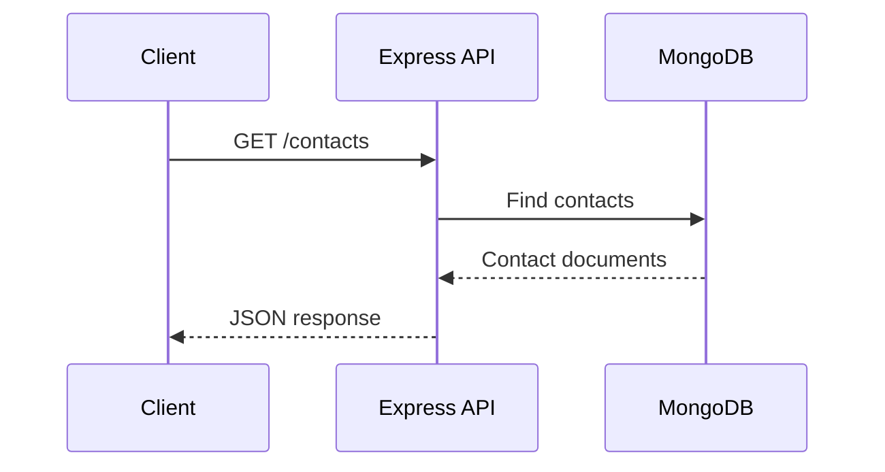
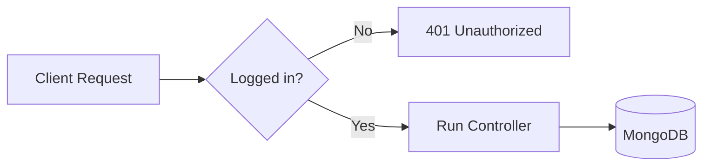

# Web Services With Node.js, Express, MongoDB, Swagger, OAuth, And Testing


## How To Use This Book

This book is written for CSE 341 Web Services. It follows the course from Week 01 through Week 07 and explains the ideas using the projects in this workspace:

- `w01-individual-activity` for the Week 01 Individual Activity.
- `contacts-api` for Weeks 01 and 02.
- `project2-crud-api` for Week 03.

The goal is not only to finish assignments. The deeper goal is to understand what each file does, why the file exists, and how a backend API behaves when a client sends a request.

This is a living manuscript. The first version focuses on the code already built for Weeks 01-03 and the concepts already read from the Week 01-07 learning material. Later revisions can expand each chapter into a longer printable book.

## Table Of Contents

1. What Web Services Are
2. The Course Stack
3. HTTP In Plain Language
4. Week 01: Node, Express, GET Routes, And MongoDB
5. Week 02: Full CRUD And Swagger Documentation
6. Week 03: Designing Your Own API
7. Validation And Error Handling
8. Week 04: Authentication, OAuth, And JWT Concepts
9. Week 05: API Gateways And Managers
10. Week 06: Testing With Jest And Supertest
11. Week 07: Explaining Your Work In Interviews
12. Code Walkthrough: Contacts API
13. Code Walkthrough: Project 2 CRUD API
14. Submission Strategy
15. Glossary

## Chapter 1: What Web Services Are

A web service is a program that accepts requests over the web and returns useful information or performs useful work. In this course, the web service is usually a Node.js and Express application. A frontend, browser, mobile app, Swagger page, or REST client sends a request. The Express server receives that request, reads the URL and HTTP method, talks to MongoDB when needed, and returns JSON.

The word "API" means Application Programming Interface. That sounds larger than it needs to. In simple language, an API is a set of rules that tells other programs how to talk to your program.

For example:

```http
GET /contacts
```

means "please give me all contacts."

```http
GET /contacts/66f1f53b6b39b57b5a147901
```

means "please give me the contact with this exact id."

```http
POST /contacts
Content-Type: application/json

{
  "firstName": "Mary",
  "lastName": "Jackson",
  "email": "mary.jackson@example.com",
  "favoriteColor": "red",
  "birthday": "1921-04-09"
}
```

means "please create a new contact using this JSON body."

The important lesson is that an API is a contract. The server promises that certain URLs and methods exist. The client promises to send data in the shape the server expects.

## Chapter 2: The Course Stack

CSE 341 uses a practical backend stack:

- Node.js runs JavaScript outside the browser.
- Express makes it easier to build HTTP routes.
- MongoDB stores documents as flexible JSON-like data.
- dotenv keeps secrets out of GitHub.
- Swagger documents and tests API routes.
- Render publishes the API online.
- OAuth protects routes and manages login later in the course.
- Jest and Supertest help prove that routes work.

The course expects you to become comfortable learning from real documentation. That is why each week links to outside resources. Technologies change, but the ability to read documentation and apply it is the long-term skill.

## Chapter 3: HTTP In Plain Language

HTTP is the request and response system of the web. A client sends a request. A server sends a response.



The most common methods in this course are:

- `GET`: read data.
- `POST`: create data.
- `PUT`: replace or update data.
- `DELETE`: remove data.

Status codes matter because they tell the client what happened:

- `200`: success with data.
- `201`: created successfully.
- `204`: success with no response body.
- `400`: the request was bad, often because validation failed.
- `404`: the requested item or route was not found.
- `500`: the server had an unexpected problem.

## Chapter 4: Week 01 - Node, Express, GET Routes, And MongoDB

Week 01 starts with the foundation. You need your tools installed, then you create a Node project, create an Express server, connect to MongoDB, and write GET routes.

The Week 01 Individual Activity teaches the simplest possible backend idea: a frontend asks for data, and a backend returns JSON. The official starter frontend calls this URL:

```js
fetch('http://localhost:8080/professional')
```

That tells us the backend must run on port `8080` and must have a route named `/professional`.

In `w01-individual-activity/server.js`, the route looks like this:

```js
app.get('/professional', (req, res) => {
  res.json({
    professionalName: 'Lebohang CSE 341 Student'
  });
});
```

The real file returns more fields than this short example, but the idea is the same. `app.get` creates a GET route. `res.json` sends JSON back to the frontend. The frontend then places that data into the HTML.

The Contacts API has this shape:

```mermaid
flowchart LR
  Browser[Browser or REST Client] --> Express[Express Server]
  Express --> ContactsRoute[/contacts route]
  ContactsRoute --> Controller[Contact Controller]
  Controller --> Store[Contact Store]
  Store --> Mongo[(MongoDB contacts)]
```

The Week 01 rubric asks for:

- A GET request that returns all contacts.
- A GET request that returns one contact by id.
- MongoDB data.
- Render deployment.
- Secrets stored in `.env`.
- MVC-style architecture.

In this workspace, those requirements live in `contacts-api`.

The route file is simple on purpose:

```js
router.get('/', controller.getAllContacts);
router.get('/:id', idRule, sendValidationErrors, controller.getContactById);
```

The route file answers the question: "What URLs exist?"

The controller answers the question: "What should happen when this URL is called?"

The data store answers the question: "How do we read or write the database?"

This separation is what the course means when it asks for MVC-style architecture. It keeps the code from becoming one giant server file.

## Chapter 5: Week 02 - Full CRUD And Swagger Documentation

Week 02 adds the rest of CRUD.

CRUD means:

- Create
- Read
- Update
- Delete

In HTTP terms:

- Create is usually `POST`.
- Read is usually `GET`.
- Update is often `PUT`.
- Delete is `DELETE`.

In the Contacts API:

```js
router.post('/', contactRules, sendValidationErrors, controller.createContact);
router.put('/:id', idRule, contactRules, sendValidationErrors, controller.updateContact);
router.delete('/:id', idRule, sendValidationErrors, controller.deleteContact);
```

Notice that POST and PUT use `contactRules`. This means data is checked before it reaches the database. That is important because a database should not be filled with incomplete or invalid records.

Swagger matters because it makes the API understandable to another person. A good Swagger page tells the user:

- Which routes exist.
- Which method each route uses.
- Which fields are required.
- Which responses can happen.
- How to test the route.

For the Week 02 video, the strongest demonstration is to open `/api-docs` on Render and use Swagger to test each route while also showing MongoDB Compass changing.

## Chapter 6: Week 03 - Designing Your Own API

Week 03 is a turning point. Instead of only extending Contacts, you design a new API of your choice.

The Week 03 project must have:

- At least two collections.
- At least one collection with seven or more fields.
- GET, POST, PUT, and DELETE for the collections.
- Swagger documentation.
- Validation.
- Error handling.
- Render deployment.
- No secrets in GitHub.

In this workspace, `project2-crud-api` uses a library idea:

- `books`
- `authors`

The `books` collection has these fields:

- `title`
- `authorName`
- `isbn`
- `genre`
- `publishedYear`
- `pages`
- `language`
- `available`
- `rating`

That is nine fields, which goes beyond the minimum seven-field rule.

The Week 3 project also uses a reusable controller factory:

```js
const controller = makeCrudController({ storeName: 'books', itemName: 'Book' });
```

That line means "build a full CRUD controller for the books store." The same pattern is used for authors. This keeps the code shorter while still being readable.

## Chapter 7: Validation And Error Handling

Validation asks: "Is the request data acceptable?"

For Contacts, a valid contact must have:

- `firstName`
- `lastName`
- `email`
- `favoriteColor`
- `birthday`

The validation file says this in code:

```js
body('email').trim().isEmail().withMessage('email must be a valid email address.')
```

That means the email field must look like a real email address. If the client sends `not-an-email`, the API returns `400`.

Error handling asks: "What should happen when something goes wrong?"

Good APIs do not crash silently. They return useful responses.

Example:

```json
{
  "error": "Contact not found",
  "message": "No contact exists with id 66f1f53b6b39b57b5a147901."
}
```

This is better than a blank page or a confusing stack trace.

## Chapter 8: Week 04 - Authentication, OAuth, And JWT Concepts

Week 04 introduces authentication and OAuth.

Authentication means proving who a user is. Authorization means deciding what that user is allowed to do.

OAuth is useful because it allows an application to rely on a trusted provider, such as Google, for login. Instead of your app collecting and storing passwords directly, the provider handles identity and gives your app proof that the user logged in.

The course also introduces JWTs. A JWT is a signed token that can carry claims about a user. A claim is a fact, such as a user id or email address. The course says JWTs are useful to understand, but OAuth is the main requirement.

In a course project, protected routes usually look like this conceptually:



For the Week 04 video, you need to show login/logout and at least two protected routes that cannot be used until authentication is present.

## Chapter 9: Week 05 - API Gateways And Managers

An API gateway sits in front of APIs and helps manage traffic. In small class projects, you usually call Express directly. In larger systems, a gateway can handle concerns like:

- Routing requests to the right service.
- Rate limiting.
- Authentication checks.
- Logging.
- Monitoring.
- Versioning.

Examples from the course material include Azure API Management, AWS API Gateway, Kong, Tyk, KrakenD, and Express Gateway.

The key idea is that a gateway protects and organizes APIs once a system grows beyond one simple server.

## Chapter 10: Week 06 - Testing With Jest And Supertest

Testing proves that code still works after changes. In API projects, tests are especially helpful because routes depend on many moving parts:

- Request method.
- URL path.
- Input body.
- Database result.
- Status code.
- Response JSON.

Jest is a test runner. Supertest is a tool that sends fake HTTP requests to an Express app during tests.

A route test often reads like this:

```js
const response = await request(app).get('/contacts');
expect(response.status).toBe(200);
expect(Array.isArray(response.body)).toBe(true);
```

In simple language, this says:

"Call GET /contacts. The API should respond with status 200. The body should be an array."

Week 06 requires GET and GET-all tests for final project routes. That means each collection should have tests for:

- `GET /collection`
- `GET /collection/:id`

## Chapter 11: Week 07 - Explaining Your Work In Interviews

Week 07 shifts toward professional preparation. This matters because building the API is only half the skill. You also need to explain what you built.

A strong interview explanation might sound like:

"I built a Node and Express API connected to MongoDB. I organized the project with route, controller, validation, and data-access layers. I documented the endpoints with Swagger and deployed the API to Render. I also added validation and error handling so bad requests return useful status codes instead of breaking the server."

That answer shows technical knowledge and ownership.

## Chapter 12: Code Walkthrough - Contacts API

The Contacts API starts in `src/server.js`.

`server.js` creates the store:

```js
const store = await createContactStore();
```

That store is either:

- A real MongoDB store when `MONGODB_URI` exists.
- A memory store when you are practicing locally.

Then it creates the app:

```js
const app = createApp({ store });
```

The app stores the database object in `app.locals`:

```js
app.locals.store = store;
```

That gives every controller access to the same store through `req.app.locals.store`.

The route:

```js
router.get('/', controller.getAllContacts);
```

calls this controller function:

```js
async function getAllContacts(req, res, next) {
  try {
    const contacts = await req.app.locals.store.findAll();
    res.json(contacts);
  } catch (error) {
    next(error);
  }
}
```

In plain language:

1. Ask the store for all contacts.
2. Return those contacts as JSON.
3. If something fails, pass the error to Express error handling.

The POST route is a little more involved:

```js
router.post('/', contactRules, sendValidationErrors, controller.createContact);
```

This route has three stages:

1. `contactRules` checks the request body.
2. `sendValidationErrors` returns 400 if anything is wrong.
3. `createContact` inserts the valid contact.

That is strong API design because the controller can assume the data already passed the basic rules.

## Chapter 13: Code Walkthrough - Project 2 CRUD API

The Project 2 API uses the same pattern, but it has two collections.

```js
app.use('/books', bookRoutes);
app.use('/authors', authorRoutes);
```

This means:

- Requests beginning with `/books` go to the book routes.
- Requests beginning with `/authors` go to the author routes.

The book validation rules are stronger because the book collection is the larger collection:

```js
body('publishedYear').isInt({ min: 1000, max: 2100 })
body('pages').isInt({ min: 1 })
body('rating').isFloat({ min: 0, max: 5 })
```

These rules protect the database from impossible data, such as:

- A book published in year 12.
- A book with 0 pages.
- A rating of 9 out of 5.

The generic controller factory exists because books and authors both need the same CRUD behavior. Instead of writing almost identical code twice, the API creates a controller for each collection.

This is a careful abstraction. It removes real duplication without hiding the course concepts.

## Chapter 14: Submission Strategy

For every project submission, think like a grader:

- Can the grader open the GitHub link?
- Can the grader open the Render link?
- Can the grader open the YouTube link?
- Does the video follow the rubric order?
- Does the video show MongoDB Compass?
- Does the video show `/api-docs`?
- Does the video prove that POST, PUT, and DELETE change the database?
- Does the video show that `.env` is not on GitHub?

The video should not be only a tour. It should be proof.

## Chapter 15: Glossary

API: A set of rules that lets programs communicate.

Backend: The server-side part of an application.

Client: The program that sends requests to the server.

CRUD: Create, Read, Update, Delete.

Endpoint: A specific URL and method in an API.

Express: A Node.js framework for building web servers.

HTTP: The request-response protocol used by the web.

JSON: A common data format used by APIs.

MongoDB: A document database used in this course.

OAuth: A login and authorization standard.

Render: A hosting platform used to publish the API.

REST: A common style for designing APIs around resources and HTTP methods.

Route: Express code that maps a URL to a function.

Swagger: API documentation that can also be used for testing.

Validation: Checking incoming data before using it.

## Expansion Plan For The Full 90-Page Version

The current manuscript is the foundation. To expand it toward roughly 90 pages, add:

- 8 to 10 pages on HTTP examples.
- 8 to 10 pages on Express route design.
- 8 to 10 pages walking through MongoDB and Compass.
- 8 to 10 pages on the Contacts project.
- 8 to 10 pages on Swagger and API documentation.
- 8 to 10 pages on Project 2 and designing collections.
- 8 to 10 pages on validation and error handling.
- 8 to 10 pages on OAuth.
- 6 to 8 pages on testing.
- 4 to 6 pages on deployment and video submission.

Each expansion should include:

- A plain-language explanation.
- A code example from this workspace.
- A diagram.
- A "what to change yourself" practice exercise.
- A short checklist.
