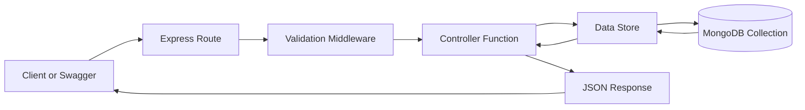

# API Request Flow

```mermaid
flowchart LR
  Client[Client or Swagger] --> Route[Express Route]
  Route --> Validator[Validation Middleware]
  Validator --> Controller[Controller Function]
  Controller --> Store[Data Store]
  Store --> MongoDB[(MongoDB Collection)]
  MongoDB --> Store
  Store --> Controller
  Controller --> Response[JSON Response]
  Response --> Client
```

This is the basic shape used in both course projects.
