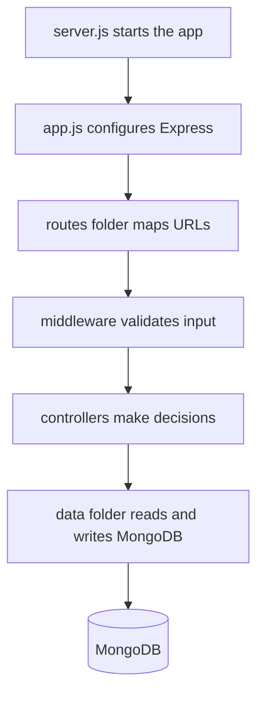

# MVC Map Used In These Projects

```mermaid
flowchart TB
  Server[server.js starts the app]
  App[app.js configures Express]
  Routes[routes folder maps URLs]
  Middleware[middleware validates input]
  Controllers[controllers make decisions]
  Data[data folder reads and writes MongoDB]
  Database[(MongoDB)]

  Server --> App
  App --> Routes
  Routes --> Middleware
  Middleware --> Controllers
  Controllers --> Data
  Data --> Database
```
